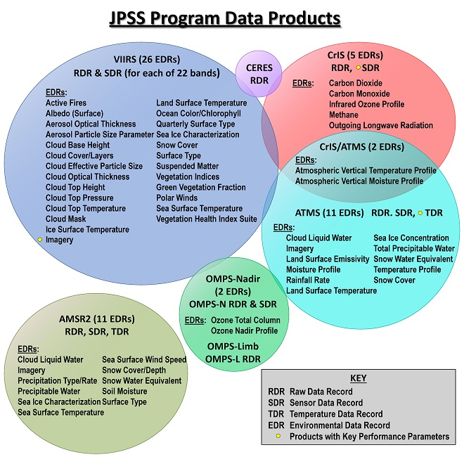

# Scripts to Access JPSS data on the AWS Public Repository

This repository contains useful Python scripts for downloading, analyzing, and visualizing [Joint Polar Satellite System](https://www.nesdis.noaa.gov/our-satellites/currently-flying/joint-polar-satellite-system) (JPSS) data products that are available on the AWS Open Data Portal. These products are provided as part of the [NOAA Open Data Dissemination](https://www.star.nesdis.noaa.gov/atmospheric-composition-training/glossary.php#nodd) (NODD) program. 



## Pre-Requisites
If you are new to Python, we recommend installing [Anaconda Python](https://www.anaconda.com/) or [Miniconda](https://docs.conda.io/projects/miniconda/en/latest/). For additional installation tips and tricks, please reference these [instructions from past JPSS training](https://www.star.nesdis.noaa.gov/atmospheric-composition-training/software_anaconda_install.php). For additional training on using Python to display NOAA satellite sets, please [review past training](https://github.com/modern-tools-workshop/AMS-python-workshop-2023).

You will need several additional packages that are not included in Anaconda/Miniconda. We recommend using Python environments to ensure the following scripts run successfully. We have included an environment file (```satellite_aerosol.yml```). Instructions for setting up Python environments can be [found here](https://www.star.nesdis.noaa.gov/atmospheric-composition-training/software_create_environment.php).

## About the datasets
The code in this repository generally uses VIIRS [Aerosol Optical Depth](https://www.star.nesdis.noaa.gov/atmospheric-composition-training/glossary.php#aerosol_optical_depth) (AOD) [Level 2 and Level 3](https://www.star.nesdis.noaa.gov/atmospheric-composition-training/satellite_data_processing_levels.php) data products. However, this code is adaptable for all JPSS products that are part of the NODD.

## Scripts

The following scripts are examples of how to download and visualize JPSS datasets.

### download_viirs_reprocessed_aod_gridded_v1.py
A unique feature of the AOD product is that the entire record [has been reprocessed](https://www.star.nesdis.noaa.gov/atmospheric-composition-training/satellite_data_operational_reprocessed.php). This dataset is more appropriate for users who are interested in a stable, long-term record.

This script will access the JPSS NODD archive of *reprocessed* VIIRS gridded (level 3) AOD data, and for a range of days entered by the user, will download available daily, weekly-averaged, or monthly-averaged files. All files have global coverage, contain high quality AOD data only, and are in [netCDF4](https://www.unidata.ucar.edu/software/netcdf/) (.nc) format. The daily files are available at 0.05°, 0.10°, or 0.25° resolution; the weekly and monthly files are available only at 0.25° resolution.

REPROCESSED VIIRS GRIDDED AOD data availablity:
* SNPP: 2012-2020
* NOAA-20: 2018-2020

*Note: Additional years will be added as they become available.*

**Instructions**: Run the script in a Python conda environment using the provided "satellite_aerosol" environment.yml configuration file (recommended). You will be asked to enter the observation start and end dates, satellite (SNPP or NOAA-20 or both), data averaging time (daily, weekly, or monthly), data resolution (0.05°, 0.10°, or 0.25°), and the name  of the directory where downloaded files will be saved. If there are no errors in any of the entered information, the script will proceed to download VIIRS files to the specified directory. If you need to stop the download while it is in progress, press the "control" and "c" keys.

### download_nucaps_edr.py

This script will access the JPSS NODD archive of the NUCAPS EDR data, and for a range of days entered by the user. This script is similar to ```download_viirs_reprocessed_aod_gridded_v1.py```.

**Instructions:**

Open the script with your favorite text editor, and select the product:

```Python
product = 'NOAA20_NUCAPS-EDR'
# other choices: NOAA20_NUCAPS-EDR, NOAA20_NUCAPS-CCR, NOAA20_NUCAPS-OLR
```
Update the date range:
```Python
year = 2023
month = 4
day = 22

start_time = '0000'
end_time = '2359'
```

You can also download the most recent data using:

```Python
# use today's date 
dt = datetime.datetime.now()
year = dt.strftime('%Y')
month = dt.strftime('%m')
day = dt.strftime('%d')

start/end hour-min
one_hour_ago = dt - datetime.timedelta(hours=1)

start_time = one_hour_ago.strftime('%H%m')
end_time = dt.strftime('%H%m')
Save and exit the script when you are done.
```

### visualize_viirs_aod_gridded_v3.py
This script opens a VIIRS gridded (Level 3) AOD data file in netCDF4 (.nc) format and plots AOD on global map, along with the global AOD data max, min, and mean, using the [Plate Carree](https://scitools.org.uk/cartopy/docs/latest/reference/projections.html) equidistant cylindrical projection with the equator as the standard parallel. The script can accommodate daily, weekly, or monthly averaged gridded AOD files, at 0.05°, 0.10°, or 0.25° resolution. The script can work with operational or reprocessed gridded AOD data files. The script can process one or more data files, making one map plot for each file. If processing multiple files, put all the data files in the same directory.

**Instructions**:  Run the script in a Python conda environment using the provided "satellite_aerosol" environment.yml configuration file (recommended). You will be asked to enter the name  of the directory where VIIRS gridded AOD files are located, the name of the directory where map image files will be saved, the maximum AOD value for displaying data on the plot (1-5), the dots per inch (DPI) resolution of the map image files (100-900), and the format of the saved map image files (png, jpg, or pdf). If there are no errors in any of the entered information, the script will proceed to create global AOD map(s).